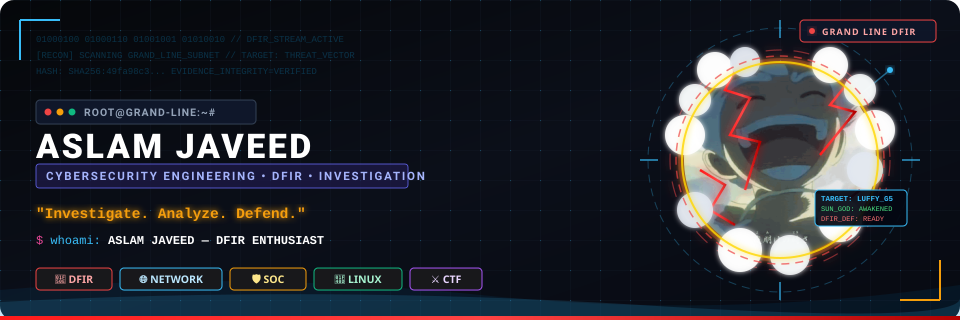

<div align="center">

<!-- Actual One Piece Monkey D. Luffy Gear 5 Animated Showcase -->
<p align="center">
  
</p>

<!-- The Grand Line of Cybersecurity HUD Banner -->
<p align="center">
  
</p>

<!-- Animated Terminal Typing Subtitle -->
<p align="center">
  <a href="https://github.com/aslamxsthets">
    
  </a>
</p>

<!-- Compact Arsenal Badges -->
<p align="center">
  <a href="https://github.com/aslamxsthets"></a>
  <a href="https://github.com/aslamxsthets"></a>
  <a href="https://github.com/aslamxsthets"></a>
  <a href="https://github.com/aslamxsthets"></a>
  <a href="https://github.com/aslamxsthets"></a>
</p>


</div>

## 🏴‍☠️ WHO AM I?

<table>
  <tr>
    <td width="42%" valign="top">
      <b>Pre-Final Year Student</b><br/>
      <b>DFIR Enthusiast</b><br/>
      <b>Investigation Focused</b>
    </td>
    <td width="58%" valign="top">
      <b>B.Tech Computer Science and Engineering</b><br/>
      <i>(IoT & Cybersecurity including Blockchain Technology)</i><br/>
      <b>Manakula Vinayagar Institute of Technology</b>
    </td>
  </tr>
</table>

> As a dedicated cybersecurity engineering student with a strong interest in Digital Forensics and Incident Response (DFIR), I focus on developing practical skills in evidence analysis, threat investigation, incident handling and post-incident reporting. My goal is to apply my DFIR skills and analytical mindset to help organizations investigate incidents, strengthen their security posture, and respond to threats more effectively.

---

## ⚔️ CURRENT MISSION

```text
$ whoami
ASLAM JAVEED — DFIR ENTHUSIAST

$ focus
Digital Forensics • Incident Response • Investigation

$ status
DFIR: READY | INVESTIGATION: ACTIVE | LEARNING: CONSTANT
```

---

## 🥷 CYBERSECURITY ARSENAL

| Category | Arsenal & Technologies |
| :--- | :--- |
| 🔎 **DIGITAL FORENSICS** | `Autopsy` • `VeraCrypt` • `Digital Forensics` • `Evidence Analysis` |
| 🌐 **NETWORK SECURITY** | `Wireshark` • `Nmap` • `Zenmap` • `Network Analysis` • `ARP Spoofing` |
| 🛡️ **SOC & DEFENSE** | `Splunk` • `SIEM` • `Threat Analysis` • `Incident Response` • `Security Alerts` |
| ⚔️ **OFFENSIVE SECURITY** | `Metasploit` • `Burp Suite` • `OWASP Juice Shop` • `Lab-based Web Security Testing` |
| 💻 **SYSTEMS & DEV** | `Kali Linux` • `Ubuntu` • `Windows` • `Linux` • `Python` • `VS Code` • `Docker` • `MongoDB Compass` |
| ☁️ **OTHER** | `Cisco Packet Tracer` • `IoT` • `Cloud Security` • `Blockchain fundamentals` |

### 🔬 INVESTIGATION TOOLKIT

| Tool | Focus | Tool | Focus |
| :--- | :--- | :--- | :--- |
| **Autopsy** | Digital Forensics | **Burp Suite** | Web Security |
| **Wireshark** | Network Analysis | **VeraCrypt** | Encryption / Disk Analysis |
| **Splunk** | SIEM / Log Analysis | **PE Explorer** | Security Analysis |
| **Nmap / Zenmap** | Network Discovery | **MongoDB Compass** | Database Tooling |
| **Metasploit** | Security Testing | **Docker** | Development / Environment |

---

## 🏴‍☠️ MISSION LOGS

| MISSION | AREA / TOOL | STATUS |
| :--- | :--- | :---: |
| **OWASP Juice Shop** – Top 10 Security Vulnerabilities | Web Security Testing | `Completed` |
| **End-to-End Secure File Sharing System** | Cryptography & AppSec | `Completed` |
| **SOC Log Analysis using Splunk** | SIEM & Incident Detection | `Completed` |
| **Network Port Discovery & Directory Enumeration** | Reconnaissance & Nmap | `Completed` |
| **Website Brute-Force Testing** (Lab Environment) | Offensive Testing | `Completed` |
| **Network Traffic Analysis using Wireshark** | Packet & Protocol Forensics | `Completed` |
| **VeraCrypt Disk Password Recovery & Decryption** | Disk Forensics & Decryption | `Completed` |
| **Metasploit Reverse Shell Implementation** | Exploit Testing & Post-Exploitation | `Completed` |
| **Shoulder-Surfing Protection in Mobile (APK)** | Mobile Security & Privacy | `Completed` |

---

## 📜 RESEARCH & INNOVATION

<details>
<summary><b>📜 Open the Research Log (11 Papers & Initiatives)</b></summary>

<br/>

- • **TATA's Green Revolution**: A Pioneer in Corporate Solutions from Industry to Ecology for SDG-15 & Biodiversity Conservation
- • **SPECTRE**: Stealth Passive Engagement & Cyber Trap Reconnaissance Engine (MSME)
- • **FloraTune**: Wearable Haptic Wristband for Real-Time Music Beat Translation & Tactile Rhythm Perception — *ICISML 2026*
- • **AR-Based Regional Language Support for Medical Training & Patient Education** — *MedNext 2025 (AICTE-VAANI)*
- • **Modular Machine Learning Framework for Real-Time Network Anomaly Detection** — *3rd International Conference on Intelligent Cyber Physical Systems & IoT (ICoICI 2025)*
- • **Smart Health Monitoring System using IoT** — *SindhanAI'25, SRM TRP*
- • **Mathematics in the Tamil Sangam Period & Its Modern Applications** — *Krishcon'25*
- • **SMVEC Innovators'25 & '26** — *Innovation Project / Participation*
- • **AI-Powered Forensic Chatbot for Secure UFDR Analysis** — *Smart India Hackathon (SIH'25)*
- • **Patient Case-Taking Software using AIML** — *Smart India Hackathon (SIH'26)*
- • **2nd Prize for presented a Startup Pitch Idea** — *MVIT Puducherry*

</details>

---

## 🌊 MY VOYAGE

| Waypoint | Voyage Mission & Event | Location / Host |
| :---: | :--- | :--- |
| ⚓ | **1-Week Cybersecurity Workshop & CTF** | SNU Chennai |
| 🏝️ | **MITILENCE'25 Capture The Flag (CTF)** | Manakula Vinayagar Institute of Technology, Puducherry |
| ⚓ | **ExploitX Meetup 0x1** | Chennai Institute of Technology |
| 🏝️ | **OWASP & DEFCON Coimbatore Chapter Meetup** | Regional Chapter Meetup |
| ⚓ | **Techfest '25 & Techfest '26** | Technical Symposium |
| 🌊 | **Electronics Week & Co-located Events** | Bengaluru |
| ⚓ | **AI in Cybersecurity and SOC & DFIR** | VIT Chennai |
| 🏝️ | **Intra-Institutional Interdisciplinary Idea Hackathon** | Manakula Vinayagar Institute of Technology, Puducherry |
| ⚔️ | **Into The Void 2.0 Capture The Flag (CTF)** | EXPLOITX CIT |

---

## 📚 TRAINING & POWER-UPS

<table>
  <tr>
    <td width="55%" valign="top">
      <b>✅ COMPLETED</b><br/><br/>
      • <b>Operating Systems Basics</b> — <i>Cisco</i><br/>
      • <b>Exploring IoT with Cisco Packet Tracer</b> — <i>Cisco</i><br/>
      • <b>Python Essentials 1</b> — <i>Cisco</i><br/>
      • <b>Introduction to Cybersecurity</b> — <i>Cisco</i><br/>
      • <b>Junior Cybersecurity Analyst Career Path</b> — <i>Cisco</i><br/>
      • <b>Embedded Systems</b> — <i>Free Course</i><br/>
      • <b>Introduction to IoT</b><br/>
      • <b>Computational Theory</b>: Language Principles & Finite Automata<br/>
      • <b>Computational Theory</b>: Turing Machines & Complexity Classes<br/>
      • <b>Agile Project Management</b>: A Concise Introduction<br/>
      • <b>Types of Cybersecurity</b><br/>
      • <b>Linux Tutorial</b><br/>
      • <b>Programming Neural Networks with TensorFlow</b>
    </td>
    <td width="45%" valign="top">
      <b>⏳ IN PROGRESS</b><br/><br/>
      • <b>Network Defense</b> — <i>Cisco</i><br/>
      • <b>Ethical Hacking</b> — <i>NPTEL</i>
    </td>
  </tr>
</table>

---

## 👥 CREW EXPERIENCE

| Organization | Domain | Focus |
| :--- | :--- | :--- |
| **Future Inters** | Cybersecurity | Practical Security & Threat Analysis |
| **Shadow Fox** | Cybersecurity | Security Operations & Investigation |

---

## 📊 GITHUB LOGBOOK

<div align="center">
  <table border="0">
    <tr>
      <td width="50%" align="center">
        
      </td>
      <td width="50%" align="center">
        
      </td>
    </tr>
  </table>

  <!-- Streak Stats Card -->
  <p align="center">
    
  </p>

  <!-- Contribution Snake Animation -->
  <p align="center">
    <picture>
      <source media="(prefers-color-scheme: dark)" srcset="https://raw.githubusercontent.com/aslamxsthets/aslamxsthets/output/github-contribution-grid-snake-dark.svg" />
      <source media="(prefers-color-scheme: light)" srcset="https://raw.githubusercontent.com/aslamxsthets/aslamxsthets/output/github-contribution-grid-snake.svg" />
      
    </picture>
  </p>
</div>

---

## ☠️ FIND ME ON THE GRAND LINE

<div align="center">
  <p>
    <a href="https://github.com/aslamxsthets">
      
    </a>
    &nbsp;
    <a href="https://linkedin.com/in/aj49/">
      
    </a>
    &nbsp;
    <a href="mailto:aslamjaveed1827@gmail.com">
      
    </a>
    &nbsp;
    <a href="tel:+919025812913">
      
    </a>
  </p>
</div>

---

<details>
<summary>☁️ You found something...</summary>

<br/>

<div align="center">
  
</div>

```text
$ gear5 --activate

╔═════════════════════════════════════════════╗
║            GEAR 5 PROTOCOL                  ║
╠═════════════════════════════════════════════╣
║ IDENTITY         : MONKEY D. LUFFY (NIKA)   ║
║ FREEDOM MODE     : ACTIVE                   ║
║ DFIR             : READY                    ║
║ INVESTIGATION    : ACTIVE                   ║
║ THREAT HUNTING   : READY                    ║
║ DRUMS OF LIBERATION: ECHOING                ║
╚═════════════════════════════════════════════╝
```

</details>

<div align="center">


<br/>

> *"The world is full of mysteries. I prefer investigating them."*

**Investigate. Analyze. Defend.**

</div>
